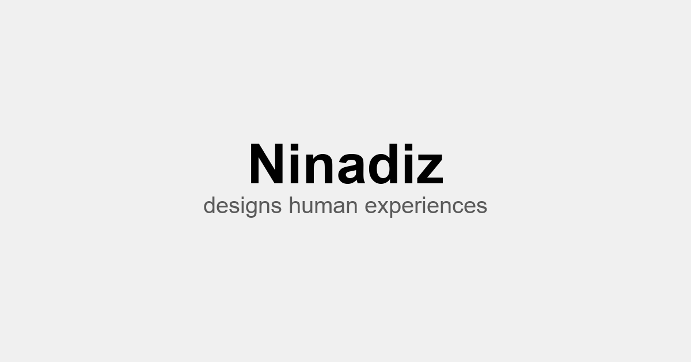

# Hi, I'm Antonina 👋

I'm a Staff UX Designer for Industrial & Deep-Tech Sectors. 
This is where my portfolio lives: [ninadiz.tech](https://ninadiz.tech)

## How was the portfolio built?

About the portfolio itself: no, it's not AI slop, and no, I didn't ask Claude for "a portfolio, make it pretty".

A modern way of managing content with <code>.md</code> and <code>.yaml</code> files

 
Every word on the site lives in plain <code>.md</code> and <code>.yaml</code> files with AI-friendly structure. No CMS to log into. No more WordPress, no pain.

Reasonable and careful use of AI

 
Claude is my junior programmer. It helps me build faster, but I still decide what gets built and why.

Human storytelling

 
Each case is written by the person who actually did the work (me!). So it's a real story with a beginning, a middle and a point, not a wall of buzzwords. 😉

## Want to build the same site?

Go ahead! Let's be honest: who can stop anyone from copying anything these days? 😄 I just hope my experience turns out useful to you, and that you'll mention me in your LinkedIn post.

- [How to run the same portfolio?](docs/setup.md)
- [How the timeline on the home page works](docs/timeline.md)
- [How to create a new case study](docs/cases.md)
