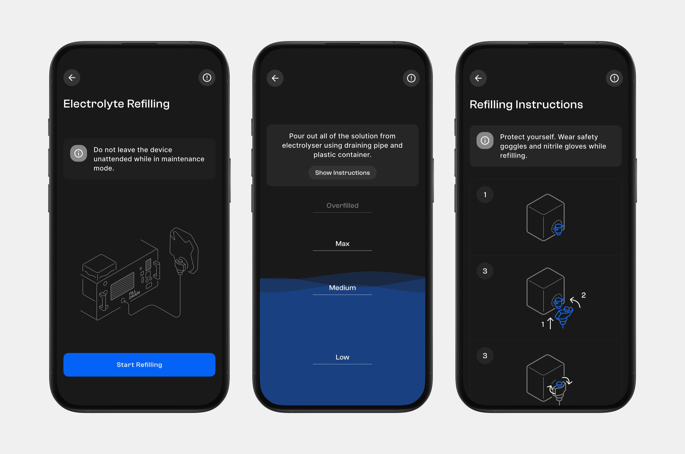
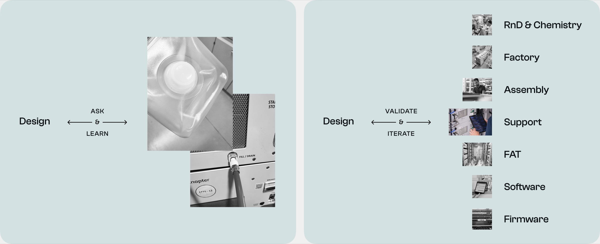
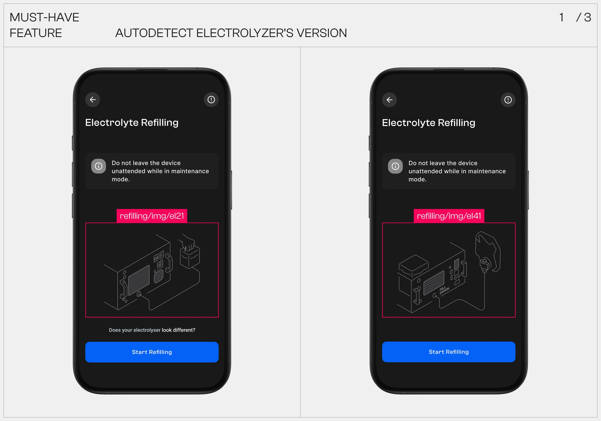
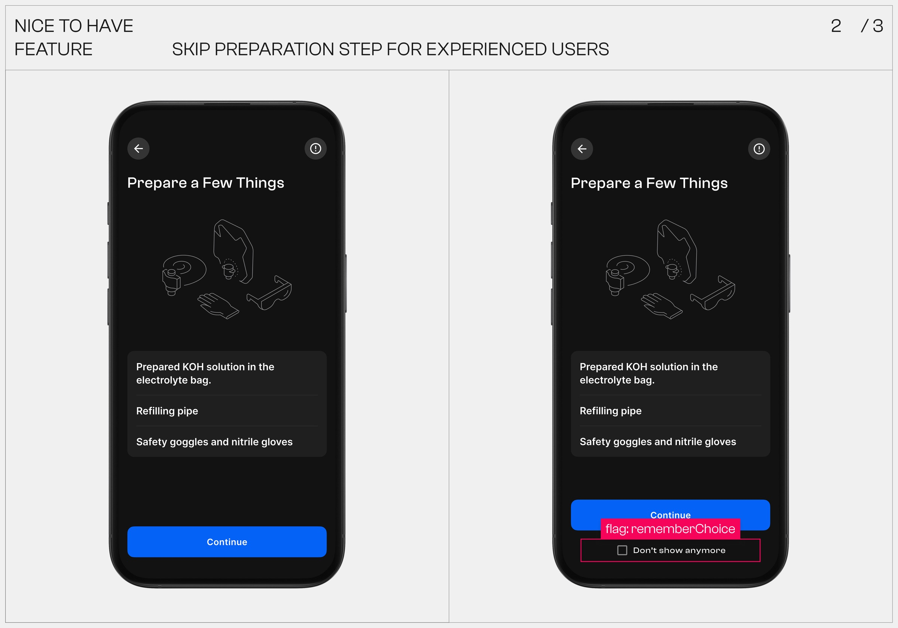
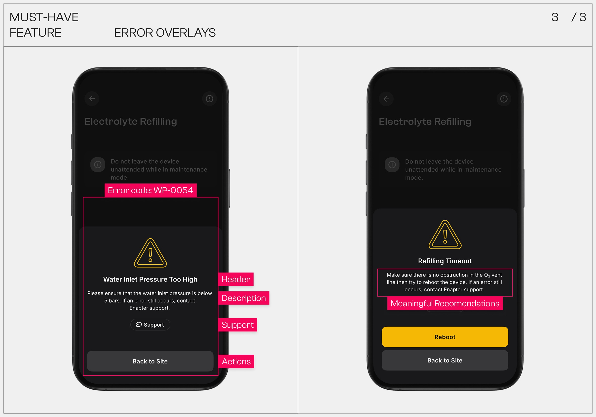
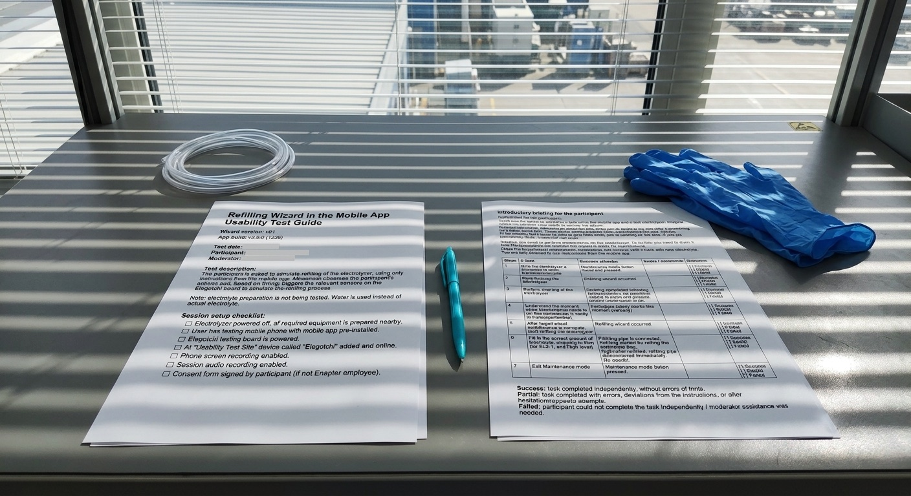
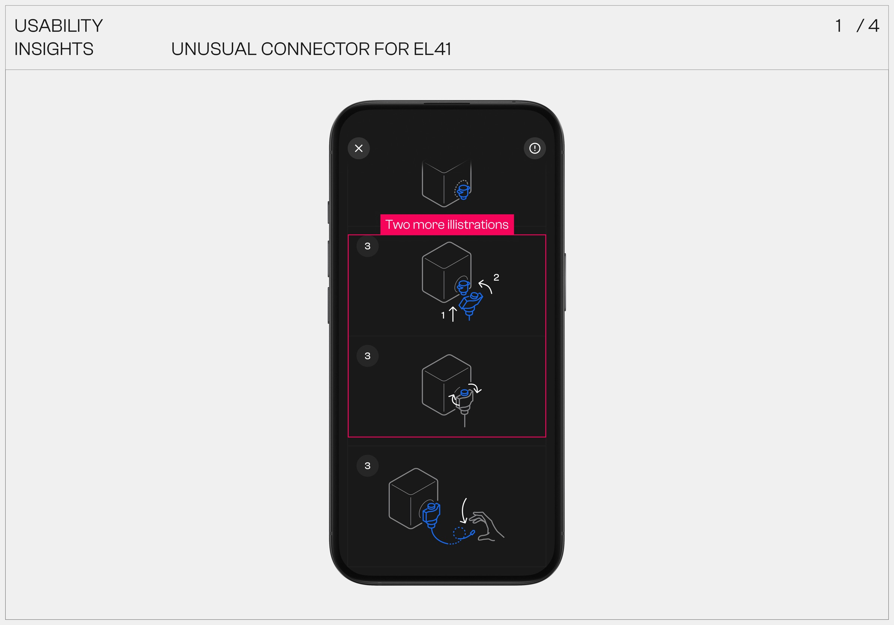

{wide}

{h2} Where we started

1. 80% of customers ask support about refilling procedure just after they received devices.
2. Maintenance routines can only be done by using lengthy paper manuals.

{h2} Suggested solution

1. Add refilling step-by-step guides to Enapter mobile apps and [electrolyser's WebGUI.](# "A web interface embedded in the firmware, designed to monitor and control devices locally.")

{wide}

{h2} Why it's important

1. First-time user experience: refilling is a first procedure after installing devices on-site.

2. Refilling is a repetitive action: every maintenance or device transportation requires device draining and refilling.

3. Limited operators' technical expertise: most onsite staff are newbies in hydrogen setups.

{h2} Research

  
Step Artifacts

  
<a href="img/usability-testing-guide.docx" title="button">  PRD (soon) ↗</a>

There was no ready-made documentation or simple given task. Only the problem.

1. Find information and define the problem across 1500+ support tickets.
2. Align ideas with RnD and Factory team. Get insights about upcoming EL4.1 model.
3. A lot of calls with engineers and firmware developers before first prototypes.

{wide}

{h2} Design and Development

  
Step Artifacts

  
<a href="img/usability-testing-guide.docx" title="button"> FigJam Userflow (soon) ↗</a>

  
<a href="img/usability-testing-guide.docx" title="button"> Figma Screens (soon) ↗</a>

I’ve brought all the data together and developed a clear MVP plan, complete with a roadmap for the wizard’s future evolution.

1. I didn’t just create the mockups in Figma. I also designed a method for storing and versioning instructions on a static server. Based on the electrolyzer version, the app automatically shows the relevant instructions.
2. I designed all the error scenarios – human-friendly headers and clear resolution steps defined for each error code and listed at GitLab.

{carousel}

{/carousel}

{h2} Usability testing challenge

  
Step Artifacts

  
<a href="img/usability-testing-guide.docx" title="button"> testing-guide.docx ↓</a>

Electrolyzers require piping connectors and extensive supporting equipment. Finding an available real device was the main bottleneck in usability & QA testing.

That's why we developed Elegotchi – a printed board that completely simulates the operation of the real electrolyzer.

{wide}

Testing process:

1. In the early beta, we tested with Enapter employees before we were allowed to run tests on external integrators' sites.
2. The participant is asked to simulate refilling of the electrolyzer, using only instructions from the mobile app.
3. For physical actions we used a turned-off electrolyzer and a [refilling kit.](# "Includes canister, refilling and draining pipes.")
4. Moderator observes the participant's actions and, based on timing, triggers the relevant sensors on the Elegotchi board to simulate the refilling process.

{wide}

{h2} Usability Testing Insights

  
Step Artifacts

  
<a href="img/usability-testing-guide.docx" title="button"> testing-insights.docx (soon) </a>

Example updates based on usability testing.

{carousel}

{/carousel}

{h2} Core impact

1. Initial support requests related to refilling reduced almost to zero.
2. 96% refilling [success rate.](# "6 months later after release, based on google analytics reports (Firebase).") via the mobile app.
3. Of the remaining 4%, most issues were not user-related (hardware or sensor errors).