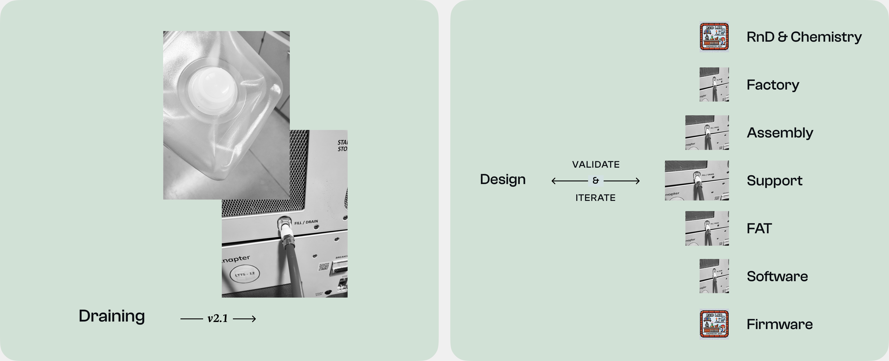

{eyebrow} Where we started

1. 80% of customers ask support about refilling procedure just they recieved devices.
2. Maintenance routines can only be done by using lengthy paper manuals.

---

{eyebrow} Suggested solution

1. Add refilling step-by-step guides to mobile apps and WebGUI of electrolysers.

---

{no-bg}
{wide}

---

{eyebrow} Why it's important

1. First-time user experience: refilling is a first procedure after installing devices on-site.

2. Refilling is a repetitive action: every maintenance or device transportation requires device draining and refilling.

3. Limited operators technical expertise: most clients staff are first-time users of hydrogen equipment.

---

{eyebrow} Research

There was no ready-made documentation or simple given task. Only the problem.

1. Find information and define the problem across 1500+ support tikets.
2. Align ideas with RnD and Factory team. Get insights about upcoming EL4.1 model.
3. A lot of calls with engineers and firmware developers before first prototypes.

---

{no-bg}
{wide}

---

{eyebrow} Usability testing

Electrolysers require piping connectors and extensive supporting equipment, which limited testing to onsite locations only.

Finding avaliable device was the main bottleneck in our usability testing. That's why we developed Elegotchi in collaboration with electrical engineer.

---

{eyebrow} Scale the design

Design should be easy to scale and reusable. Each iteration ....

---

{eyebrow} Impact

1. 96% refilling success rate via the mobile app.
2. Of the remaining 4%, most issues were not user-related (hardware or sensor errors).
3. Support requests related to refilling reduced almost to 0.

